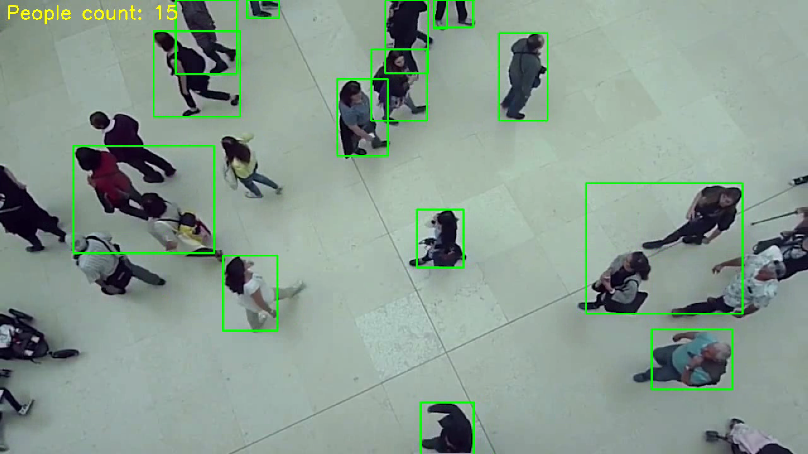

# Crowd Monitoring (Flask API)

This is a Flask-based REST API that performs crowd monitoring using computer vision techniques. It uses a pre-trained YOLOv8 object detection model to detect people in video files, counts them in each frame, annotates the frames with bounding boxes and crowd counts, and returns a processed video.

---

## Main Features

- Upload video files via API
- Detect and count people in each frame using YOLOv8
- Annotate each frame with bounding boxes and crowd count
- Output an annotated video with the results
- Download the processed video

---

## Working

1. **Upload Endpoint (`/upload`)**
   - Accepts a video file (`mp4`, `avi`, `mov`)
   - Saves it to the server

2. **Process Endpoint (`/process`)**
   - Loads the uploaded video
   - Uses **YOLOv8** to detect people (`class ID 0`)
   - Counts and annotates each frame
   - Outputs a new video file

3. **Download Endpoint (`/download/<filename>`)**
   - Returns the processed video for download

---

## Project Structure

```
Computer-Vision-Crowd-Monitoring-Flask-API/
│
├── app.py                  # Main Flask application
├── requirements.txt        # Requirements for python environment
├── uploads/                # Folder for uploaded videos
├── processed/              # Folder for processed output videos
├── files/                  # Folder with support files
└── README.md               
```

---

## Running Locally

1. Clone the repository:
   ```bash
   git clone https://github.com/yourusername/crowd-monitoring-api.git
   cd crowd-monitoring-api
   ```

2. Create and activate a virtual environment(windows):
   ```bash
   python -m venv venv
   venv\Scripts\activate 
   ```

3. Install dependencies:
   ```bash
   pip install -r requirements.txt
   ```

   *(or manually install)*
   ```bash
   pip install flask ultralytics opencv-python
   ```

4. Run the Flask app:
   ```bash
   python app.py
   ```

   You should see:
   ```
   Running on http://127.0.0.1:5000
   ```

---

## Using the API with Postman

### 1. Upload a Video

- **Method**: `POST`
- **URL**: `http://127.0.0.1:5000/upload`
- **Body**:
  - Type: `form-data`
  - Key: `video` (set to type `File`)
  - Value: Select your video file (e.g., `1.mp4`)

📥 **Response**:
```json
{
  "status": "success",
  "filename": "your_uploaded_filename.mp4"
}
```

---

### 2. Process the Uploaded Video

- **Method**: `POST`
- **URL**: `http://127.0.0.1:5000/process`
- **Headers**:
  ```
  Content-Type: application/json
  ```
- **Body**:
  - Select `raw`
  - Choose `JSON`
  - Example:
    ```json
    {
      "filename": "your_uploaded_filename.mp4"
    }
    ```

**Response**:
```json
{
  "status": "success",
  "download_url": "/download/processed_your_uploaded_filename.mp4"
}
```

---

### 3. Download the Processed Video

- Open your browser or use Postman:
  ```
  GET http://127.0.0.1:5000/download/processed_your_uploaded_filename.mp4
  ```

---


## 📷 Example

Annotated frames look like this:

- Green bounding boxes for each detected person
- Label: `People count: <number>`

---

